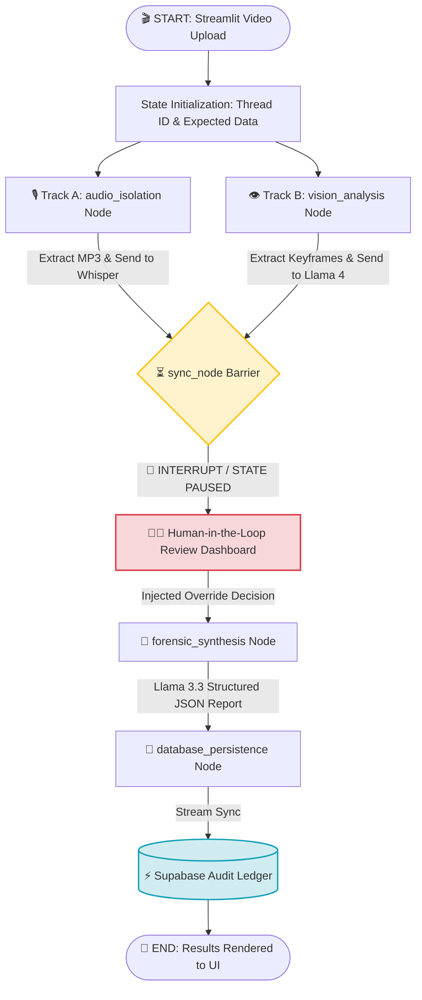

# 🚀 **Try it here:** [KYC Auditor Agent](https://huggingface.co/spaces/Rahul007007/Kyc-Auditor-Agent)

---
# 🕵️‍♂️ KYC Forensic Audit Engine

A state-of-the-art, multi-stream automated KYC (Know Your Customer) identity verification and forensic analysis platform. Powered by **LangGraph**, **Llama 4 Vision**, **Groq Whisper**, and **Streamlit**, this application processes customer Video-Ident sessions in parallel, performs deep liveness and document integrity checks, supports a native **Human-in-the-Loop (HITL)** compliance override, and streams structural telemetry data into an enterprise database.

---

## 🚀 Key Features

* **Parallel Multi-Stream Ingestion:** Simultaneously isolates audio tracks and extracts temporal video keyframes to minimize total processing latency.
* **Strict OCR & Document Verification:** Leverages Llama 4 Vision to match identity documents dynamically against expected database profiles (Name/DOB) and screens out non-government card fraud.
* **Human-in-the-Loop (HITL) Guardrails:** Built-in LangGraph state checkpointers actively pause execution before final synthesis, forcing a human compliance officer to approve or reject findings visually.
* **Cognitive Forensic Synthesis:** Uses advanced reasoning models to synthesize raw data streams, resolve human override anomalies, and produce structured, audit-ready compliance payloads.
* **Self-Cleaning Storage Pipeline:** Temporarily buffers video binaries in ephemeral RAM/scratch disks, purging data instantly post-analysis to uphold global data privacy regulations (e.g., GDPR, BaFin).

---

## 🛠️ Tech Stack & Core Libraries

| Component | Technology / Library | Role in Architecture |
| :--- | :--- | :--- |
| **Orchestration** | `langgraph` | Handles state machine topology, parallel nodes, and runtime thread interrupts. |
| **AI Processing** | `langchain-groq` / `groq` | Drives high-speed inference for vision, transcription, and report synthesis. |
| **Vision Model** | `meta-llama/llama-4-scout-17b-16e-instruct` | Executes liveness tracking, tampering detection, and rigid OCR analysis. |
| **Audio Model** | `whisper-large-v3` | transcribes user voice confirmation to monitor behavioral signals. |
| **UI Dashboard** | `streamlit` | Implements the Auditor interface across Ingestion, Review, and Complete phases. |
| **Media Parsing** | `moviepy` & `pillow` | Handles background OS-level audio extraction and keyframe translation. |
| **Database** | `supabase` | Real-time global synchronization for structural auditing data records. |
| **Containerization**| `docker` | Package infrastructure sandboxing for production-grade web deployments. |

---

## 📊 Application Flow Architecture

The platform transitions out of traditional linear graph pipelines, utilizing an advanced **Fan-Out/Fan-In Sync design pattern with State Checkpointing**:

---

## ⏳ Video Upload Procedure

Please record or upload a short **10–15 second** video while performing the following actions **in order**.

### Step 1: Facial Liveness Check (First 3 Seconds)

- Look directly into the camera.
- Do **not** wear hats, sunglasses, masks, or use heavy beauty filters.
- Maintain good lighting and avoid excessive head movement.

### Step 2: Present Your Government ID (Next 5 Seconds)

- Hold the **front** of your Government-issued ID (Passport, National ID, or Driver's License) beside your face.
- Ensure your **Name** and **Date of Birth** are fully visible.

### Step 3: Voice Confirmation (Final 5 Seconds)

While continuing to hold your ID beside your face, read the following statement clearly:

> "My name is John Doe, born on January 1st, 1990, and I am recording this video for official identity verification compliance."